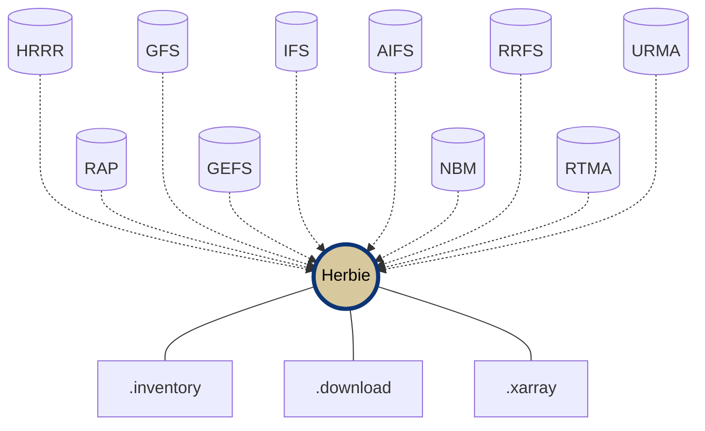

<div align="center">

# HerbieNG: Download Weather Forecast Model Data in Python

**Access HRRR, GFS, RAP, GEFS, IFS and more!**

<!-- Badges -->

[](https://github.com/blaylockbk/Herbie/actions/workflows/tests-conda.yml)
[](https://github.com/blaylockbk/Herbie/actions/workflows/tests-python.yml)
[](https://github.com/astral-sh/ruff)

<!-- (Badges) -->

</div>

---

## What is HerbieNG?

HerbieNG is a fork of the [Herbie](https://github.com/blaylockbk/Herbie) Python package that makes downloading and working with numerical weather prediction (NWP) model data simple and fast. Whether you're a researcher, meteorologist, data scientist, or weather enthusiast, Herbie provides easy access to forecast data from NOAA, ECMWF, and other sources.

**Key Features:**
- 🌐 **Access 15+ weather models** - HRRR, GFS, RAP, GEFS, ECMWF, and more
- ⚡ **Smart downloads** - Get full GRIB2 files or subset by variable to save time and bandwidth
- 🔄 **Multiple data sources** - Automatically searches different archive (AWS, Google Cloud, NOMADS, Azure)
- 📊 **Built-in data reading** - Load data directly into xarray for analysis
- 🛠️ **CLI and Python API** - Use from command line or in your Python scripts
- 🗺️ **Visualization aids** - Includes Cartopy integration for mapping

**Keywords:** weather data download, GRIB2, python, numerical weather prediction, meteorological data, weather forecast API, xarray, atmospheric data, research, academia, data science, machine learning,visualization


---

## Quick Start

### Installation

**With conda or pip:**
```bash
python3 -m pip install -e .
```

*Note: optional features require manual installation of wgrib2*

*Note: make sure you use `python3 -m pip` if conda is in use*

### Simple Example

```python
from herbie import Herbie

# Create a Herbie object for HRRR model data
H = Herbie(
    '2021-01-01 12:00',  # Date and time
    model='hrrr',         # Model name
    product='sfc',        # Product type
    fxx=6                 # Forecast hour
)

# Show file contents
H.inventory()

# Download and read 2-meter temperature
temperature = H.xarray("TMP:2 m")
```

### Command Line Interface

```bash
# Download HRRR surface forecast
herbie download -m hrrr --product sfc -d "2023-03-15 12:00" -f 0

# Get specific variable (temperature at 850 mb)
herbie download -m gfs --product 0p25 -d 2023-03-15 -f 24 --subset ":TMP:850 mb:"

# View available variables
herbie inventory -m rap -d 2023031512 -f 0
```

---

## Supported Weather Models

Herbie provides access to a wide range of numerical weather prediction models:

### US Models (NOAA)

#### Regional 

- **[HRRR](https://herbie.readthedocs.io/en/latest/gallery/noaa_models/hrrr.html)** - High Resolution Rapid Refresh (3km resolution)
- **[HRRR-Alaska](https://herbie.readthedocs.io/en/latest/gallery/noaa_models/hrrrak.html)** - Alaska version
- **[RAP](https://herbie.readthedocs.io/en/latest/gallery/noaa_models/rap.html)** - Rapid Refresh
- **[NAM](https://herbie.readthedocs.io/en/latest/gallery/noaa_models/nam.html)** - North American Mesoscale Model
- **[NBM](https://herbie.readthedocs.io/en/latest/gallery/noaa_models/nbm.html)** - National Blend of Models
- **[RTMA/URMA](https://herbie.readthedocs.io/en/latest/gallery/noaa_models/rtma-urma.html)** - Real-Time/Un-Restricted Mesoscale Analysis
- **[RRFS](https://herbie.readthedocs.io/en/latest/gallery/noaa_models/rrfs.html)** - Rapid Refresh Forecast System *(prototype)*
- **[HAFS](https://herbie.readthedocs.io/en/latest/gallery/noaa_models/hafs.html)** - Hurricane Analysis and Forecast System

#### Global

- **[GFS](https://herbie.readthedocs.io/en/latest/gallery/noaa_models/gfs.html)** - Global Forecast System
- **[GEFS](https://herbie.readthedocs.io/en/latest/gallery/noaa_models/gefs.html)** - Global Ensemble Forecast System
- **[AIGFS](https://herbie.readthedocs.io/en/latest/gallery/noaa_models/aigfs.html)** - AI Emulator of Global Forecast System
- **[AIGEFS](https://herbie.readthedocs.io/en/latest/gallery/noaa_models/aigefs.html)** - AI Emulator of Global Ensemble Forecast System
- **[HGEFS](https://herbie.readthedocs.io/en/latest/gallery/noaa_models/hgefs.html)** - Hybrid Global Ensemble Forecast System
- **[CFS](https://herbie.readthedocs.io/en/latest/gallery/noaa_models/cfs.html)** - Climate Forecast System

Much of this data is made available through the [NOAA Open Data Dissemination](https://www.noaa.gov/information-technology/open-data-dissemination) (NODD) program.

### Other Models
- **[ECMWF - IFS](https://herbie.readthedocs.io/en/latest/gallery/ecmwf_models/ecmwf.html)** - ECMWF's Integrated Forecast System
- **[ECMWF - AIFS](https://herbie.readthedocs.io/en/latest/gallery/ecmwf_models/ecmwf.html)** - ECMWF's Artificial Intelligence Forecast System
- **[HRDPS](https://herbie.readthedocs.io/en/latest/gallery/eccc_models/hrdps.html)** - Canada's High Resolution Deterministic Prediction System (Canada)
- **[NAVGEM](https://herbie.readthedocs.io/en/latest/gallery/usnavy_models/navgem.html)** - U.S. Navy Global Environmental Model

**[View all models in the gallery →](https://herbie.readthedocs.io/en/latest/gallery/index.html)**


---

## Core Capabilities

**Features:**
- 🔍 Search model output from different data sources
- ⬇️ Download full or subset GRIB2 files
- 📖 Read data with xarray and index files with Pandas
- 🗺️ Built-in Cartopy aids for mapping
- 🎯 Extract data at specific points
- 🔌 Extensible with [custom model templates](https://github.com/blaylockbk/herbie-plugin-tutorial)




### Python API

Herbie's Python API is used like this:

```python
from herbie import Herbie

# Herbie object for the HRRR model 6-hr surface forecast product
H = Herbie(
  '2021-01-01 12:00',
  model='hrrr',
  product='sfc',
  fxx=6
)

# View all variables in a file
H.inventory()

# Download options
H.download()              # Download full GRIB2 file
H.download(":500 mb")     # Download subset (all 500 mb fields)
H.download(":TMP:2 m")    # Download specific variable

# Read data into xarray
ds = H.xarray("TMP:2 m")  # 2-meter temperature
ds = H.xarray(":500 mb")  # All 500 mb level data
```

### Command Line Interface

Herbie also has a command line interface (CLI) so you can use Herbie right in your terminal.

```bash
# Get the URL for a HRRR surface file from today at 12Z
herbie data -m hrrr --product sfc -d "2023-03-15 12:00" -f 0

# Download GFS 0.25° forecast hour 24 temperature at 850mb
herbie download -m gfs --product 0p25 -d 2023-03-15T00:00 -f 24 --subset ":TMP:850 mb:"

# View all available variables in a RAP model run
herbie inventory -m rap -d 2023031512 -f 0

# Download multiple forecast hours for a date range
herbie download -m hrrr -d 2023-03-15T00:00 2023-03-15T06:00 -f 1 3 6 --subset ":UGRD:10 m:"

# Specify custom source priority (check only Google)
herbie data -m hrrr -d 2023-03-15 -f 0 -p google
```
## Data Sources

Herbie automatically searches for data at multiple data sources:

- [NOMADS](https://nomads.ncep.noaa.gov/)
- [NOAA Open Data Dissemination Program (NODD)](https://www.noaa.gov/information-technology/open-data-dissemination) partners (i.e., AWS, Google, Azure).
- [ECMWF Open Data Forecasts](https://www.ecmwf.int/en/forecasts/datasets/open-data)
- University of Utah CHPC Pando archive
- Local file system

---

## Documentation & Help

💬 **[GitHub Discussions](https://github.com/christophertubbs/HerbieNG/discussions)** - Ask questions and share ideas

🚑 **[Report Issues](https://github.com/christophertubbs/HerbieNG/issues)** - Found a bug? Let us know

---

## Contributing

We welcome contributions! Here's how you can help:

- ⭐ Star this repository
- 👀 Watch for new discussions and issues
- 💬 Participate in [GitHub Discussions](https://github.com/christophertubbs/HerbieNG/discussions)
- 🐛 Report bugs or suggest features via [Issues](https://github.com/christophertubbs/HerbieNG/issues)
- 📝 Improve documentation
- 🧪 Test latest releases
- 💻 Submit pull requests
